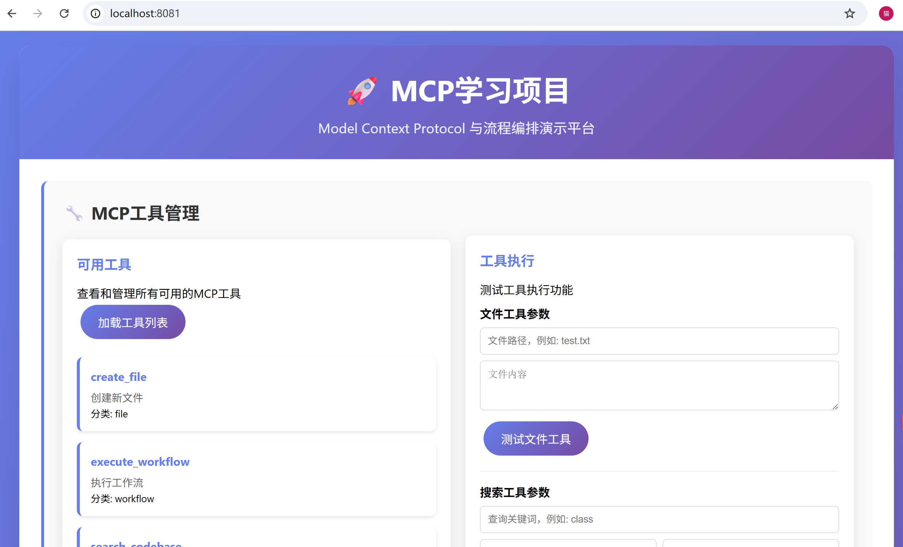
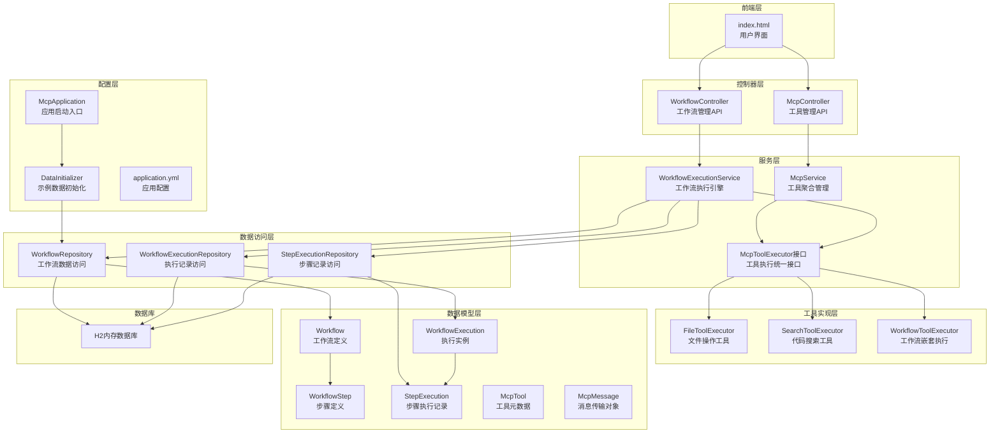
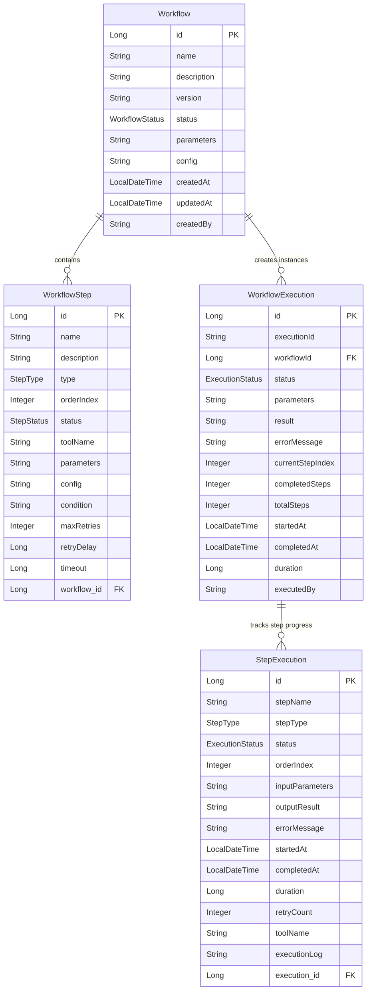
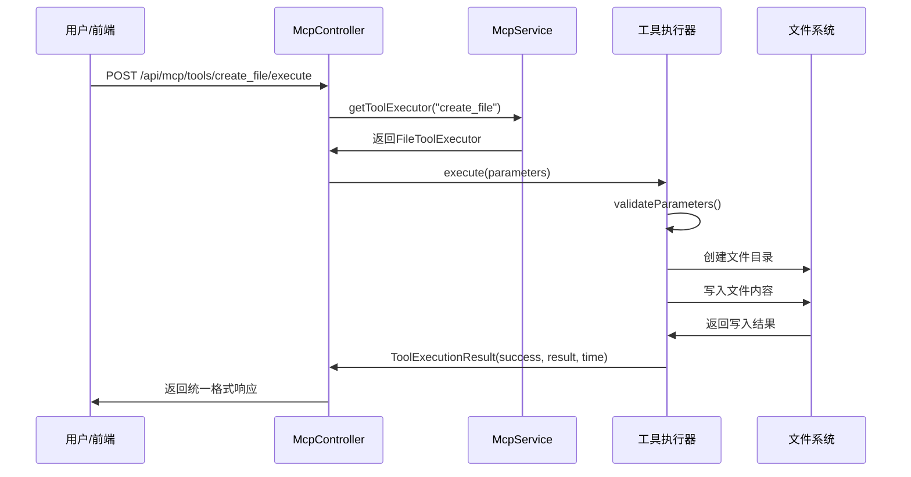
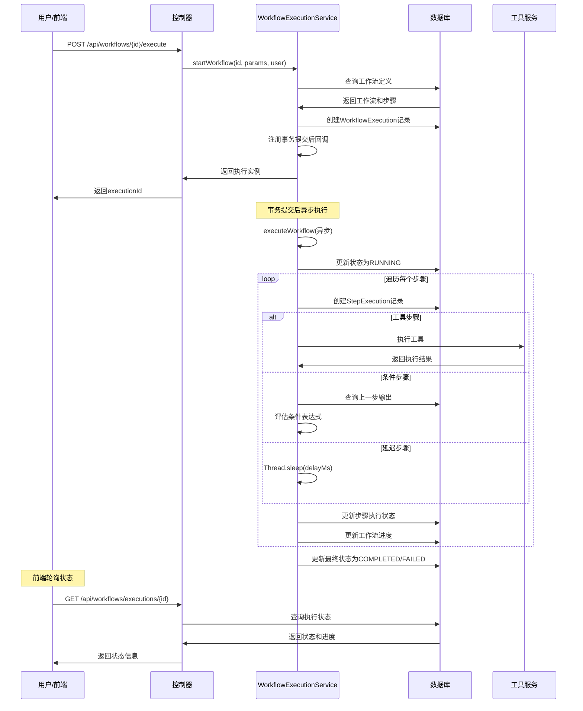

# MCP 学习项目

> 一个基于 Spring Boot 的 MCP (Model Context Protocol) 学习项目，演示工具编排与工作流执行

## 📚 文件依赖学习顺序

按照文件之间的依赖关系学习，每个文件依赖前面的文件：

### 🎯 学习路径（22个文件）

#### 📝 基础配置文件
**1. `pom.xml`** → **2. `application.yml`** → **3. `McpApplication.java`**

#### 📊 核心模型文件（按依赖关系）
**4. `McpTool.java`** → **5. `McpMessage.java`** → **6. `WorkflowStep.java`** → **7. `Workflow.java`** → **8. `StepExecution.java`** → **9. `WorkflowExecution.java`**

#### 🗄️ 数据访问文件（按模型依赖）
**10. `WorkflowRepository.java`** → **11. `StepExecutionRepository.java`** → **12. `WorkflowExecutionRepository.java`**

#### ⚙️ 服务层文件（按调用关系）
**13. `McpToolExecutor.java`** → **14. `FileToolExecutor.java`** → **15. `SearchToolExecutor.java`** → **16. `WorkflowToolExecutor.java`** → **17. `McpService.java`** → **18. `WorkflowExecutionService.java`**

#### 🌐 控制器文件（按服务依赖）
**19. `McpController.java`** → **20. `WorkflowController.java`**

#### 🔧 配置和前端
**21. `DataInitializer.java`** → **22. `index.html`**

---

### 🔗 详细依赖关系说明

```
McpTool (独立) 
    ↓
McpMessage (独立)
    ↓
WorkflowStep (引用 StepType 枚举)
    ↓
Workflow (包含 List<WorkflowStep>)
    ↓
StepExecution (引用 WorkflowStep.StepType, 关联 WorkflowExecution)
    ↓
WorkflowExecution (包含 List<StepExecution>)
    ↓
WorkflowRepository (操作 Workflow)
    ↓
StepExecutionRepository (操作 StepExecution)
    ↓
WorkflowExecutionRepository (操作 WorkflowExecution)
    ↓
McpToolExecutor (接口，定义工具执行规范)
    ↓
FileToolExecutor (实现 McpToolExecutor)
    ↓
SearchToolExecutor (实现 McpToolExecutor)
    ↓
WorkflowToolExecutor (实现 McpToolExecutor)
    ↓
McpService (聚合所有 McpToolExecutor)
    ↓
WorkflowExecutionService (使用 McpService + Repository)
    ↓
McpController (使用 McpService)
    ↓
WorkflowController (使用 WorkflowExecutionService)
    ↓
DataInitializer (使用 Repository 创建数据)
    ↓
index.html (调用 Controller API)
```

## ✨ 特性

- 🔧 **工具执行框架** - 支持文件操作、代码搜索等多种工具
- 🔄 **工作流编排** - 可视化工作流定义与执行
- 📊 **实时监控** - 执行状态跟踪与进度展示
- 🎯 **JSON-RPC 支持** - 兼容 MCP 协议标准
- 💾 **持久化存储** - H2 数据库存储工作流定义和执行记录
- 🌐 **Web 界面** - 简洁美观的管理控制台

## 🚀 快速开始

### 环境要求

- Java 17+
- Maven 3.6+

### 运行项目

```bash
# 克隆项目
git clone <your-repo-url>
cd study-MCP

# 编译运行
mvn spring-boot:run
```

### 访问应用

- **Web 界面**: http://localhost:8081
- **API 文档**: http://localhost:8081/api/mcp/tools
- **H2 控制台**: http://localhost:8081/h2-console

### 快速体验

1. 打开 Web 界面：http://localhost:8081
2. 在"工具测试"区域测试文件创建工具
3. 在"工作流执行"区域执行预置的示例工作流
4. 观察实时执行状态和进度

## 📋 API 文档

### 工具管理 API

| 方法 | 端点 | 描述 |
|------|------|------|
| GET | `/api/mcp/tools` | 获取所有可用工具 |
| POST | `/api/mcp/tools/{toolName}/execute` | 执行指定工具 |
| POST | `/api/mcp/message` | MCP JSON-RPC 消息处理 |

### 工作流管理 API

| 方法 | 端点 | 描述 |
|------|------|------|
| GET | `/api/workflows` | 获取所有工作流 |
| POST | `/api/workflows/{id}/execute` | 执行指定工作流 |
| GET | `/api/workflows/executions/{executionId}` | 查询执行状态 |
| GET | `/api/workflows/executions/running` | 获取运行中的执行 |

### 工具说明

#### 1. create_file - 文件创建工具
```json
{
  "path": "example.txt",
  "content": "文件内容"
}
```

#### 2. search_codebase - 代码搜索工具
```json
{
  "query": "class",
  "fileType": "java",
  "includeDirs": ["src/main/java"],
  "excludeDirs": ["target"]
}
```

#### 3. execute_workflow - 工作流执行工具
```json
{
  "workflowId": "1",
  "parameters": {}
}
```

## 🏗️ 项目架构




## 一、项目配置与依赖分析

### 1.1 Maven配置 (`pom.xml`)

```xml
<!-- 核心依赖配置 -->
<parent>
    <groupId>org.springframework.boot</groupId>
    <artifactId>spring-boot-starter-parent</artifactId>
    <version>3.5.4</version>
</parent>

<properties>
    <java.version>17</java.version>
</properties>
```

**关键依赖解析：**

| 依赖 | 作用 | 在项目中的体现 |
|------|------|----------------|
| `spring-boot-starter-web` | Web应用基础 | `McpController` REST API |
| `spring-boot-starter-data-jpa` | JPA数据访问 | Repository层的数据持久化 |
| `spring-statemachine-core` | 状态机编排 | 工作流状态转换管理 |
| `h2` | 内存数据库 | 存储工作流定义和执行记录 |
| `spring-boot-starter-webflux` | 响应式HTTP客户端 | MCP协议的HTTP通信 |
| `lombok` | 代码简化 | 所有model类的注解 |

### 1.2 应用配置 (`application.yml`)

```yaml
# 核心配置
server:
  port: 8081  # Web服务端口

spring:
  datasource:
    url: jdbc:h2:mem:mcplearning  # H2内存数据库
    driver-class-name: org.h2.Driver
  
  jpa:
    hibernate:
      ddl-auto: create-drop  # 每次启动重建表结构
    show-sql: true  # 显示SQL语句，便于调试

# 自定义MCP配置
mcp:
  server:
    host: localhost
    port: 3000
    timeout: 30000
  workflow:
    max-retries: 3
    retry-delay: 1000
```

## 二、数据模型层详细分析

### 2.1 核心实体关系


### 2.2 模型类详细解析

#### `Workflow.java` - 工作流定义
```java
@Entity
@Table(name = "workflows")
public class Workflow {
    // 工作流元信息
    private String name;        // 工作流名称
    private String description; // 工作流描述
    private String version;     // 版本号
    
    // 工作流状态：DRAFT, ACTIVE, INACTIVE, DEPRECATED
    private WorkflowStatus status;
    
    // 步骤定义 - 使用 @JsonManagedReference 避免循环序列化
    @OneToMany(mappedBy = "workflow", cascade = CascadeType.ALL, fetch = FetchType.EAGER)
    @JsonManagedReference
    private List<WorkflowStep> steps;
}
```

**关键设计点：**
- 使用 `@JsonManagedReference` 和 `@JsonBackReference` 解决JSON序列化循环引用
- `fetch = FetchType.EAGER` 确保加载工作流时同时加载所有步骤
- `cascade = CascadeType.ALL` 确保工作流删除时步骤一并删除

#### `WorkflowStep.java` - 步骤定义
```java
public enum StepType {
    TOOL,       // 工具步骤 - 调用具体工具
    CONDITION,  // 条件步骤 - 基于前置步骤结果判断
    LOOP,       // 循环步骤 - 暂未实现
    PARALLEL,   // 并行步骤 - 暂未实现
    DELAY,      // 延迟步骤 - 等待指定时间
    CUSTOM      // 自定义步骤 - 扩展用
}
```

**步骤类型说明：**
- `TOOL`: 最核心的步骤类型，通过 `toolName` 字段指定要执行的工具
- `CONDITION`: 条件判断，使用 `condition` 字段存储表达式如 `"resultCount > 0"`
- `DELAY`: 延迟执行，在 `config` 中配置延迟时间

#### `WorkflowExecution.java` - 执行实例
```java
// 关键字段解析
private String executionId;    // UUID，唯一标识一次执行
private Integer currentStepIndex;   // 当前执行到第几步
private Integer completedSteps;     // 已完成步骤数
private Integer totalSteps;         // 总步骤数

// 计算执行进度的方法
public double getProgress() {
    if (totalSteps == 0) return 0.0;
    return (double) completedSteps / totalSteps * 100.0;
}
```

**设计亮点：**
- 使用 `@JsonIgnore` 避免序列化 `stepExecutions` 集合，防止返回数据过大
- 提供进度计算方法，便于前端展示进度条
- 使用 `@PreUpdate` 自动计算执行时长

#### `McpTool.java` - 工具元数据
```java
// 输入参数模式 - 类似JSON Schema
private Map<String, Object> inputSchema;

// 示例：文件工具的输入模式
{
    "type": "object",
    "properties": {
        "path": {"type": "string", "description": "文件路径"},
        "content": {"type": "string", "description": "文件内容"}
    },
    "required": ["path", "content"]
}
```

**作用说明：**
- 为前端提供工具的元信息展示
- `inputSchema` 定义工具所需的输入参数结构
- 静态工厂方法如 `createFileTool()` 便于创建预定义工具

#### `McpMessage.java` - JSON-RPC协议消息
```java
// JSON-RPC 2.0 标准格式
private String jsonrpc = "2.0";    // 协议版本
private String id;                 // 请求ID
private String method;             // 方法名
private Map<String, Object> params; // 参数
private Object result;             // 响应结果
private McpError error;            // 错误信息
```

## 三、数据访问层 (Repository)

### 3.1 Repository接口设计

所有Repository都继承 `JpaRepository<Entity, ID>`，提供基础CRUD操作。

#### `WorkflowRepository.java`
```java
// 核心查询方法
List<Workflow> findByStatus(Workflow.WorkflowStatus status);
List<Workflow> findByCreatedBy(String createdBy);
List<Workflow> findByNameContainingIgnoreCase(String name);

@Query("SELECT w FROM Workflow w WHERE w.status = 'ACTIVE'")
List<Workflow> findActiveWorkflows();
```

#### `WorkflowExecutionRepository.java`
```java
// 关键查询功能
Optional<WorkflowExecution> findByExecutionId(String executionId);
List<WorkflowExecution> findByWorkflowIdOrderByStartedAtDesc(Long workflowId, Pageable pageable);

@Query("SELECT e FROM WorkflowExecution e WHERE e.status = 'RUNNING'")
List<WorkflowExecution> findRunningExecutions();

@Query("SELECT e.status, COUNT(e) FROM WorkflowExecution e GROUP BY e.status")
List<Object[]> countByStatus();  // 统计各状态的执行数量
```

**设计特点：**
- 使用 `Optional<>` 处理可能为空的查询结果
- 提供分页查询支持（`Pageable`）
- 自定义统计查询便于监控系统状态

## 四、业务逻辑层 (Service)

### 4.1 工具执行框架

#### `McpToolExecutor` 接口
```java
public interface McpToolExecutor {
    String getToolName();                    // 工具名称
    String getToolDescription();             // 工具描述
    McpTool getToolModel();                 // 工具元数据
    ToolExecutionResult execute(Map<String, Object> parameters);  // 执行工具
    boolean validateParameters(Map<String, Object> parameters);   // 参数验证
    
    // 统一的执行结果封装
    class ToolExecutionResult {
        private final boolean success;       // 是否成功
        private final Object result;         // 结果数据
        private final String errorMessage;   // 错误信息
        private final long executionTime;    // 执行耗时(毫秒)
    }
}
```

**设计优势：**
- 统一的接口规范，所有工具实现保持一致
- 结果封装包含成功标志、结果数据、错误信息、执行时间
- 支持参数验证，提升系统健壮性

#### `McpService` - 工具聚合服务
```java
@Service
public class McpService {
    private final Map<String, McpToolExecutor> toolExecutors = new ConcurrentHashMap<>();
    
    @Autowired
    public McpService(List<McpToolExecutor> executors) {
        // 启动时自动注册所有工具执行器
        for (McpToolExecutor executor : executors) {
            toolExecutors.put(executor.getToolName(), executor);
        }
    }
}
```

**核心功能：**
- 自动发现并注册所有 `McpToolExecutor` 实现类
- 提供工具列表查询、工具执行、JSON-RPC消息处理
- 使用 `ConcurrentHashMap` 保证线程安全

### 4.2 工具实现详解

#### `FileToolExecutor` - 文件操作工具
```java
@Override
public ToolExecutionResult execute(Map<String, Object> parameters) {
    String path = (String) parameters.get("path");
    String content = (String) parameters.get("content");
    
    // 创建文件路径，确保父目录存在
    Path filePath = Paths.get(path);
    Path parentDir = filePath.getParent();
    if (parentDir != null && !Files.exists(parentDir)) {
        Files.createDirectories(parentDir);
    }
    
    // 写入文件
    Files.write(filePath, content.getBytes(), 
                StandardOpenOption.CREATE, StandardOpenOption.TRUNCATE_EXISTING);
    
    return ToolExecutionResult.success(Map.of(
        "path", path,
        "size", content.length(),
        "created", true
    ), executionTime);
}
```

**实现亮点：**
- 自动创建父目录，避免文件创建失败
- 使用 `StandardOpenOption` 确保文件创建或覆盖
- 返回详细的执行结果（路径、大小、状态）

#### `SearchToolExecutor` - 代码搜索工具
```java
// 支持的搜索参数
{
    "query": "class",                    // 搜索关键词
    "fileType": "java,kt",              // 文件类型（支持多扩展名）
    "includeDirs": ["src/main/java"],   // 包含目录
    "excludeDirs": ["target", ".git"]   // 排除目录
}

// 核心搜索逻辑
private List<SearchResult> performSearch(String query, String fileType, 
                                       List<String> includeDirs, Set<String> extraExcludedDirs) {
    PathMatcher fileMatcher = buildFileMatcher(fileType);
    
    Files.walkFileTree(searchDir, new SimpleFileVisitor<Path>() {
        @Override
        public FileVisitResult preVisitDirectory(Path dir, BasicFileAttributes attrs) {
            // 跳过排除的目录（.git, target, node_modules等）
            if (shouldExcludeDirectory(dir)) {
                return FileVisitResult.SKIP_SUBTREE;
            }
            return FileVisitResult.CONTINUE;
        }
        
        @Override
        public FileVisitResult visitFile(Path file, BasicFileAttributes attrs) {
            // 文件类型过滤 + 内容搜索
            if (fileMatcher != null && !fileMatcher.matches(file.getFileName())) {
                return FileVisitResult.CONTINUE;
            }
            List<SearchMatch> matches = searchInFile(file, query);
            if (!matches.isEmpty()) {
                results.add(new SearchResult(file.toString(), matches));
            }
            return FileVisitResult.CONTINUE;
        }
    });
}
```

**特色功能：**
- 支持正则表达式搜索，大小写不敏感
- 智能文件类型过滤（支持 `*.java` 或 `java,kt` 格式）
- 预设排除目录（`.git`, `target`, `node_modules` 等）
- 返回匹配的行号和内容

### 4.3 工作流执行引擎

#### `WorkflowExecutionService` - 核心执行服务

```java
@Transactional
public WorkflowExecution startWorkflow(String workflowId, Map<String, Object> parameters, String executedBy) {
    // 1. 验证工作流存在且状态为ACTIVE
    Workflow workflow = workflowRepository.findById(Long.valueOf(workflowId))
            .orElseThrow(() -> new IllegalArgumentException("工作流不存在"));
    
    // 2. 创建执行实例
    WorkflowExecution execution = WorkflowExecution.builder()
            .executionId(UUID.randomUUID().toString())
            .workflowId(workflow.getId())
            .status(WorkflowExecution.ExecutionStatus.PENDING)
            .totalSteps(workflow.getSteps().size())
            .build();
    
    // 3. 保存执行实例
    execution = executionRepository.save(execution);
    
    // 4. 事务提交后异步启动执行
    TransactionSynchronizationManager.registerSynchronization(new TransactionSynchronization() {
        @Override
        public void afterCommit() {
            CompletableFuture.runAsync(() -> executeWorkflow(executionId, workflowId));
        }
    });
    
    return execution;
}
```

**关键设计：**
- 使用 `TransactionSynchronization.afterCommit()` 确保异步执行在事务提交后开始
- 避免读取未提交的数据导致的数据不一致问题
- 返回执行实例供前端轮询状态

#### 步骤执行逻辑
```java
private boolean executeStep(WorkflowExecution execution, WorkflowStep step) {
    switch (step.getType()) {
        case TOOL:
            return executeToolStep(stepExecution, step);
        case CONDITION:
            return executeConditionStep(stepExecution, step);
        case DELAY:
            return executeDelayStep(stepExecution, step);
        default:
            return false;
    }
}

// 工具步骤执行
private boolean executeToolStep(StepExecution stepExecution, WorkflowStep step) {
    // 1. 解析步骤参数
    Map<String, Object> parameters = parseParameters(step.getParameters());
    
    // 2. 合并执行级参数（可覆盖步骤参数）
    Map<String, Object> execParams = parseParameters(stepExecution.getExecution().getParameters());
    if (execParams != null) {
        parameters.putAll(execParams);
    }
    
    // 3. 执行工具
    McpToolExecutor.ToolExecutionResult result = mcpService.getToolExecutor(step.getToolName()).execute(parameters);
    
    // 4. 记录输入输出（使用ObjectMapper序列化JSON）
    stepExecution.setInputParameters(new ObjectMapper().writeValueAsString(parameters));
    stepExecution.setOutputResult(new ObjectMapper().writeValueAsString(result.getResult()));
    
    return result.isSuccess();
}

// 条件步骤执行
private boolean executeConditionStep(StepExecution stepExecution, WorkflowStep step) {
    // 获取上一个完成步骤的输出
    List<StepExecution> steps = stepExecutionRepository.findByExecution(stepExecution.getExecution());
    StepExecution prevCompleted = steps.stream()
            .filter(s -> s.getStatus() == StepExecution.ExecutionStatus.COMPLETED)
            .max(Comparator.comparing(StepExecution::getOrderIndex))
            .orElse(null);
    
    // 解析结果数量
    int resultCount = 0;
    if (prevCompleted != null) {
        resultCount = extractTotalCountFromOutput(prevCompleted.getOutputResult());
    }
    
    // 评估条件表达式（支持 resultCount > 0 等简单表达式）
    return evaluateCondition(step.getCondition(), resultCount);
}
```

**条件表达式支持：**
```java
// 支持的条件格式
"resultCount > 0"     // 结果数量大于0
"resultCount >= 5"    // 结果数量大于等于5
"resultCount == 0"    // 结果数量等于0
"resultCount < 10"    // 结果数量小于10
```

## 五、控制器层 (Controller)

### `McpController.java` - REST API控制器

```java
@RestController
@RequestMapping("/api/mcp")
@CrossOrigin(origins = "*")
public class McpController {
    
    // 获取所有可用工具
    @GetMapping("/tools")
    public ResponseEntity<List<McpTool>> listTools();
    
    // 执行指定工具
    @PostMapping("/tools/{toolName}/execute")
    public ResponseEntity<Map<String, Object>> executeTool(
            @PathVariable String toolName,
            @RequestBody Map<String, Object> parameters);
    
    // 兼容MCP JSON-RPC协议
    @PostMapping("/message")
    public ResponseEntity<McpMessage> handleMessage(@RequestBody McpMessage message);
    
    // 系统状态查询
    @GetMapping("/status")
    public ResponseEntity<Map<String, Object>> getStatus();
}
```

**API返回格式统一：**
```json
// 工具执行响应
{
    "success": true,
    "executionTime": 150,
    "result": {
        "path": "test.txt",
        "size": 25,
        "created": true
    }
}

// 错误响应
{
    "success": false,
    "executionTime": 50,
    "errorMessage": "参数验证失败"
}
```

## 六、配置与初始化

### `DataInitializer.java` - 示例数据初始化

实现 `CommandLineRunner` 接口，在应用启动后自动初始化示例工作流：

#### 示例工作流1：文件处理工作流
```java
Workflow fileProcessingWorkflow = Workflow.builder()
    .name("文件处理工作流")
    .steps(Arrays.asList(
        // 步骤1：创建文件
        WorkflowStep.builder()
            .name("创建示例文件")
            .type(StepType.TOOL)
            .toolName("create_file")
            .parameters("{\"path\": \"sample.txt\", \"content\": \"示例内容\"}")
            .orderIndex(1)
            .build(),
        // 步骤2：延迟2秒
        WorkflowStep.createDelayStep("等待处理", 2000L, 2),
        // 步骤3：搜索刚创建的文件
        WorkflowStep.builder()
            .name("搜索文件内容")
            .type(StepType.TOOL)
            .toolName("search_codebase")
            .parameters("{\"query\": \"示例文件\", \"fileType\": \"txt\", \"includeDirs\": [\".\"]}")
            .orderIndex(3)
            .build()
    ))
    .build();
```

#### 示例工作流2：代码搜索工作流
```java
Workflow searchWorkflow = Workflow.builder()
    .name("代码搜索工作流")
    .steps(Arrays.asList(
        // 步骤1：搜索Java文件中的class关键词
        WorkflowStep.builder()
            .name("搜索Java文件")
            .type(StepType.TOOL)
            .toolName("search_codebase")
            .parameters("{\"query\": \"class\", \"fileType\": \"java\"}")
            .orderIndex(1)
            .build(),
        // 步骤2：条件判断 - 如果搜索结果大于0继续
        WorkflowStep.createConditionStep("检查搜索结果", "resultCount > 0", 2),
        // 步骤3：延迟1秒
        WorkflowStep.createDelayStep("处理延迟", 1000L, 3)
    ))
    .build();
```

## 七、前端页面分析

### `index.html` - 单页面应用

前端采用原生JavaScript + CSS，提供完整的工具和工作流管理界面：

#### 功能模块
1. **工具管理**
   - 显示所有可用工具
   - 提供文件工具和搜索工具的参数输入界面
   - 实时显示工具执行结果

2. **工作流管理**
   - 显示所有工作流列表
   - 选择并执行工作流
   - 查看运行中的执行实例

3. **执行监控**
   - 实时显示执行状态和进度
   - 进度条可视化显示
   - 执行日志记录

#### 关键JavaScript函数
```javascript
// 工具执行
async function testFileTool() {
    const response = await fetch('/api/mcp/tools/create_file/execute', {
        method: 'POST',
        headers: { 'Content-Type': 'application/json' },
        body: JSON.stringify({ 
            path: filePath, 
            content: fileContent 
        })
    });
}

// 工作流执行
async function executeWorkflow() {
    const response = await fetch(`/api/workflows/${workflowId}/execute`, {
        method: 'POST',
        body: JSON.stringify({
            parameters: {},
            executedBy: 'web-user'
        })
    });
    
    // 开始状态监控
    startStatusMonitoring(execution.executionId);
}

// 状态监控
function startStatusMonitoring(executionId) {
    statusCheckInterval = setInterval(async () => {
        const response = await fetch(`/api/workflows/executions/${executionId}`);
        const execution = await response.json();
        
        // 更新进度条
        const progressPercent = (execution.completedSteps / execution.totalSteps) * 100;
        progressBar.style.width = `${progressPercent}%`;
        
        // 执行完成则停止监控
        if (execution.status === 'COMPLETED' || execution.status === 'FAILED') {
            clearInterval(statusCheckInterval);
        }
    }, 2000);
}
```

## 八、项目执行流程详解

### 8.1 工具执行流程

### 8.2 工作流执行流程

## 九、关键技术点和最佳实践

### 9.1 JSON序列化循环引用处理
```java
// Workflow 中使用 @JsonManagedReference
@OneToMany(mappedBy = "workflow")
@JsonManagedReference
private List<WorkflowStep> steps;

// WorkflowStep 中使用 @JsonBackReference
@ManyToOne
@JsonBackReference
private Workflow workflow;

// WorkflowExecution 中使用 @JsonIgnore
@OneToMany(mappedBy = "execution")
@JsonIgnore
private List<StepExecution> stepExecutions;
```

### 9.2 异步执行的事务安全
```java
// 确保在事务提交后再启动异步任务
TransactionSynchronizationManager.registerSynchronization(new TransactionSynchronization() {
    @Override
    public void afterCommit() {
        CompletableFuture.runAsync(() -> executeWorkflow(executionId, workflowId));
    }
});
```

### 9.3 参数安全解析
```java
// 使用ObjectMapper安全解析JSON参数
private Map<String, Object> parseParameters(String parameters) {
    if (parameters == null || parameters.trim().isEmpty()) {
        return new HashMap<>();
    }
    try {
        return new ObjectMapper().readValue(parameters, Map.class);
    } catch (Exception e) {
        log.warn("参数解析失败: {}", parameters, e);
        return new HashMap<>();
    }
}
```

### 9.4 进度监控和状态管理
```java
// 提供实时进度计算
public double getProgress() {
    if (totalSteps == 0) return 0.0;
    return (double) completedSteps / totalSteps * 100.0;
}

// 前端轮询机制
setInterval(async () => {
    const execution = await fetchExecutionStatus(executionId);
    updateProgressBar(execution.progress);
    if (execution.isCompleted) {
        clearInterval(statusCheckInterval);
    }
}, 2000);
```

